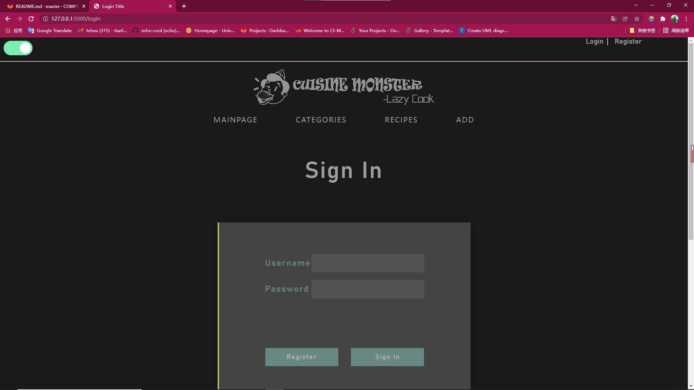
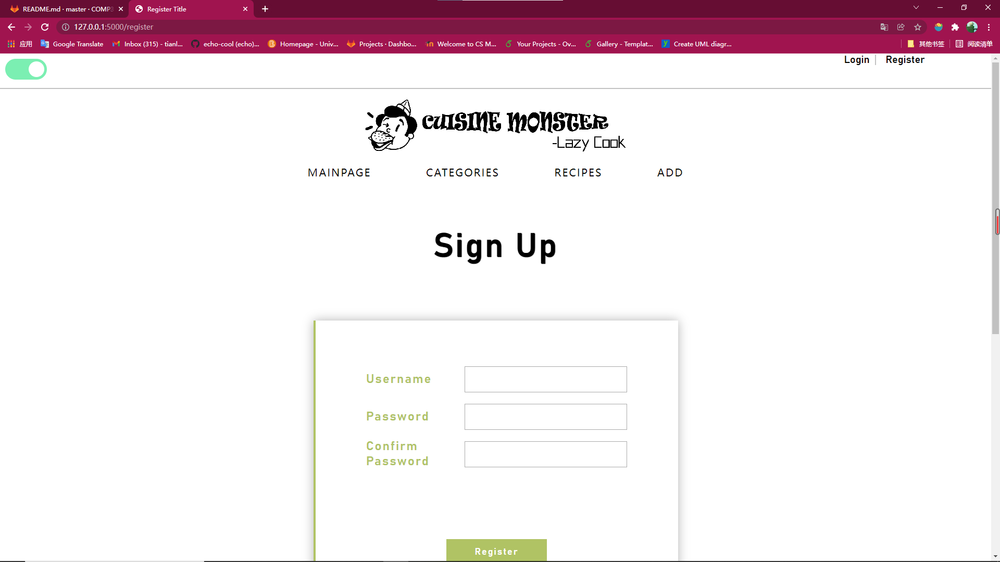
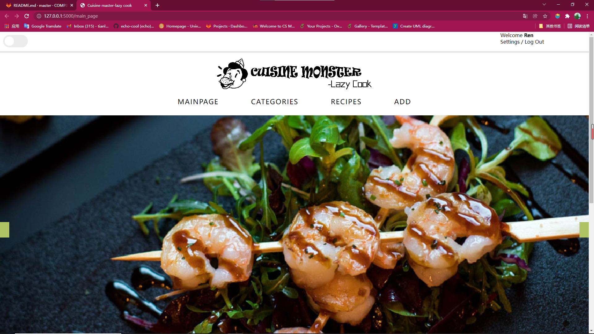
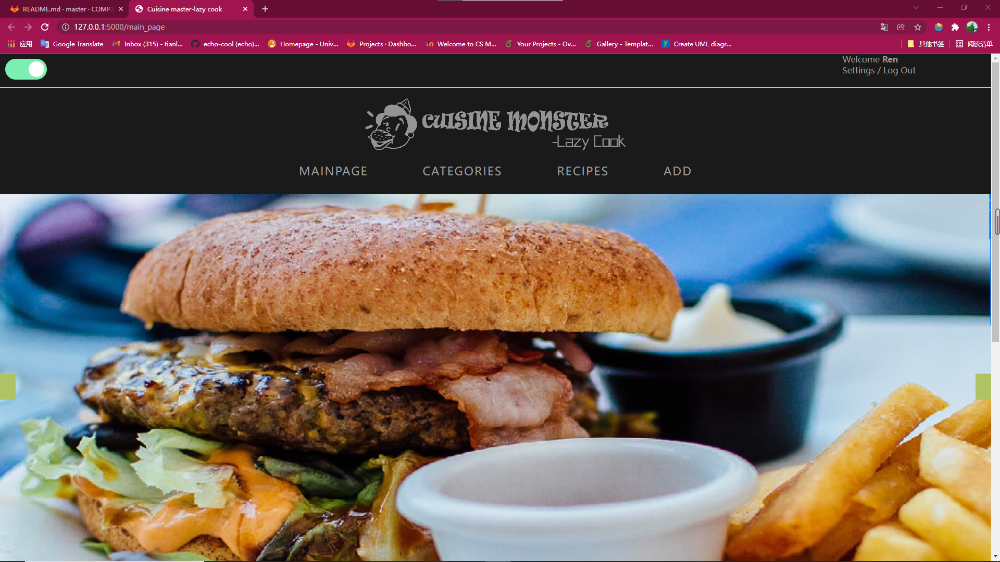
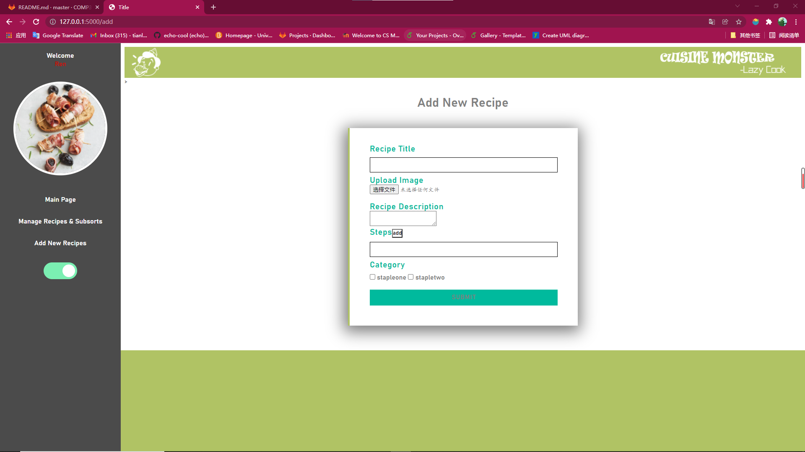
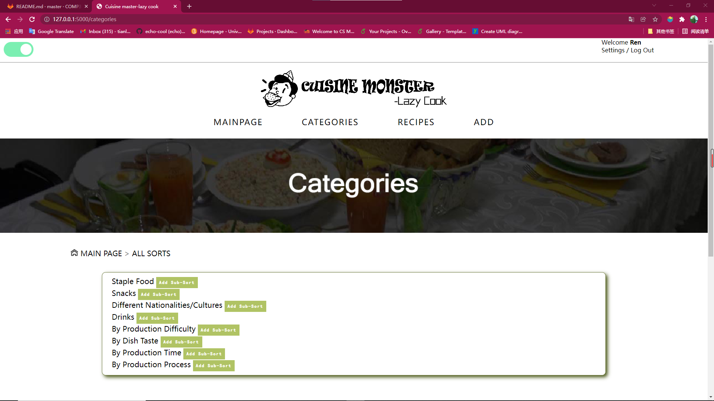
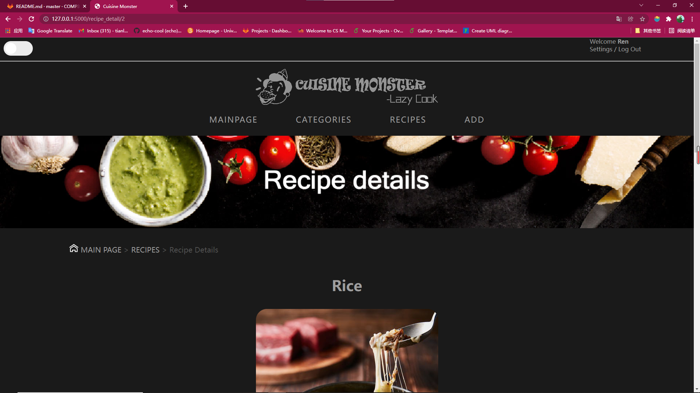
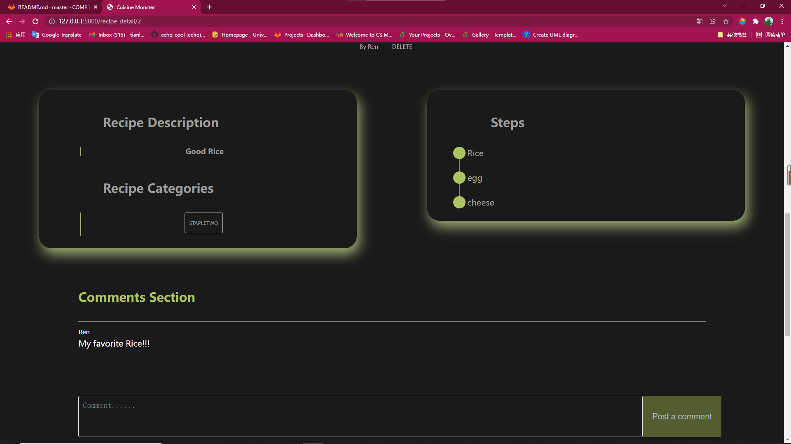
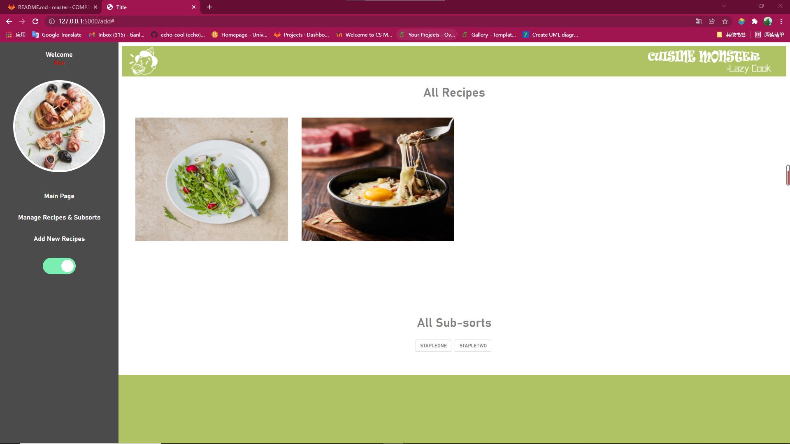
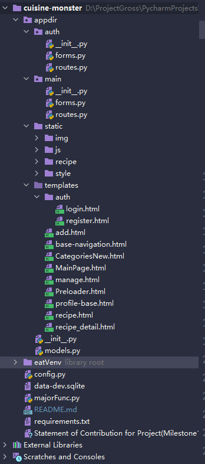

# CUISINE MONSTER -- LAZY COOK

#### Application Introduction

This web application aims to assist user's cookery. Decent and various recipes will be posted up for all the users to study and discuss. Apart from dish recipes, we have created a category page for users to seek for their fancy recipes more conveniently. we also support you to add your own ideas in the category page. There are 8 big categories including drinks, cultures..., and logged in users can create sub-categories under them like Thai Food, Italian Food...whatever you are into.

#### Description(Major Functionality)

1. It supports user to login and register. While registering, a confirming email will be sent to user's email account to confirm. When users forgets their passwords, they can reset passwords by confirming email accounts again. The user can also log out after logging in.

2. All users(logged in and un-logged in ) can view all the categories and recipes, and the main page.

3. It supports logged in users to upload recipe name, image and detailed introduction. All the recipes will be displayed on the pages.

4. It supports all users to use categories to filter recipes that they really concentrate on. 8 main categories are provided already. 
5. Logged in Users can add sub-categories under 8 main categories according to their wishes.

6. Under recipes, logged in users can comment what they want to say to share experience and viewpoints. Recipe owners can delete what recipe they created before. The recipe steps and belonging sorts are displayed in the detailed recipe pages.

7. Each logged in user should own a private profile page to display their recipes and subsorts. They can view and manage what they uploaded easily.
 
8. (More details are not included in README, you can enjoy those designs.)

What have been achieved **till Milestone 1**:

The 1st, 2nd, and 5th are fully implemented. The 3rd currently supports logged in users to upload recipe name and image. Uploaded recipe name and image should be displayed at the recipe page. The 4th currently supports 8 main categories but filtering is not implemented yet. The 6th and 7th are not reached yet.

What have been achieved **till Milestone 2**:

We implemented all the functions planned.

#### Environment Configuration

This is a Python FLASK web application. We recommend you to use Python 3.9+ to run it. At the root of the project, you can see a "requirements.txt" which provides all needed packages.

To utilize that requirement file, you can use command "pip install -r requirements.txt" to install all the necessary dependent packages. As developers, we strongly recommend you not to use high level FLASK since low versions are much more stable.

To run the application, you should set "majorFunc.py" as the main running file.

#### User Instruction

Till milestone one, we support login, register, and self-created categories. 

At the main page,  you can see login and register functions on the navigation bar. You can follow the instruction to register and login.

As introduced above, you can add your sub-categories under 8 big categories. At the right side of them, you can see buttons to add your own ideas. Noteworthy, your sub-category name should be unique to avoid ambiguity. Once you submit successfully, your sub-category should be displayed under that big category.

Entering into each sub-sort, you can see its recipes(you can also choose to view all recipes without filters).

#### Application Framework

#### Developers

19206214 Ren Tianli

19206227 Gao Ruihan
